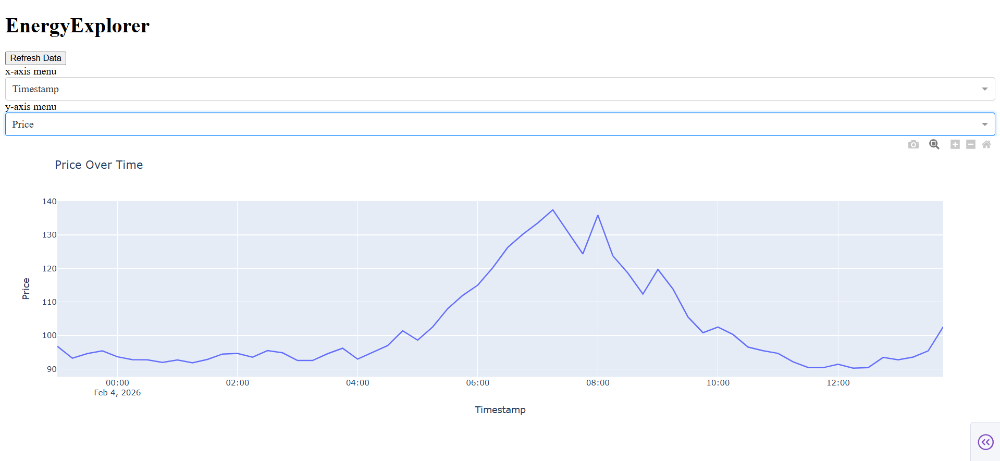
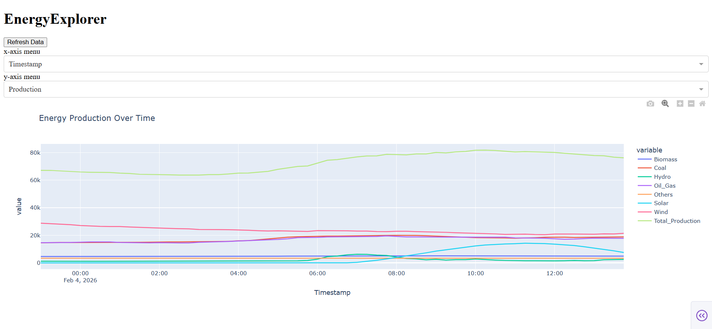

# EnergyExplorer

## Anforderungen

Die Entstehende Webseite soll es ermöglichen, verschiedene Eckdaten zur Auswahl zu haben und diese in einem Zeitstrahl darstellen zu können. Dabei sollen die Preisentwicklung, die Produktionsmenge an Strom und der Anteil Erneuerbarer Energien als mögliche, auswählbare Eckdaten zur Verfügung stehen. Des weiteren soll die Datenspeicherung so erfolgen, dass später ohne weiteres neue Eckdaten hinzugefügt werden können.

Die Webseite soll zuerst auf Englisch geschrieben sein, um eine breitere Zielgruppe abzudecken. Eine Deutsche Übersetzung kann später hinzugefügt werden.

## Datenquellen

die Verwendete API ist die [Energy-Charts API](https://www.energy-charts.info/api.html?l=de&c=DE). Spezifisch werden die Endpunkte "Total Power" und "Price" abgerufen und die Daten gespeichert.

## Datenaufbereitung

Die abgerufenen Daten werden direkt nach dem Abruf in gröbere Produktionsarten zusammengefasst, ungenutzte Daten gefiltert und einige weitere Datenpunkte hinzugefügt, die aus den Ursprungsdaten errechnet werden.

## Datenbankstruktur 

Die SQLite-Datenbank, die hier verwendet wird, hat zwei Tabellen (s. Diagramm). Damit werden in der Datensicherung die Preisdaten und die Produktionsdaten sauber getrennt.

:::mermaid
erDiagram
production{
    integer Timestamp PK
    real Biomass
    real Biomass_pct
    real Coal
    real Coal_pct
    real Hydro
    real Hydro_pct
    real Oil_Gas
    real Oil_Gas_pct
    real Others
    real Others_pct
    real Solar
    real Solar_pct
    real Wind
    real Wind_pct
    real Total_Production
    real Ren_share
    real Ren_share_bin
}

prices{
    integer Timestamp PK
    real Price
}
:::

## Visualisierung / GUI-Konzept 

## Architektur / Datenfluss 

:::mermaid
architecture-beta

group app(internet)[EnergyExplorer]
group data(cloud)[ ]

service pipeline(server)[Pipeline] in app
service db(database)[Data] in app
service server(server)[Website] in app

service api(server)[API] in data

pipeline:R --> L:db
db:B --> T:server

api:R --> L:pipeline
:::

## Technische Tools

Das Projekt ist komplett in Python geschrieben. Die Visualisierung ist mit Dash realisiert und die Datenaufbereitung passiert mit Pandas.